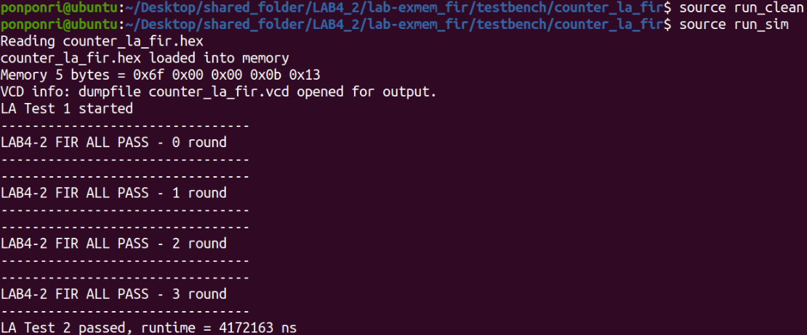
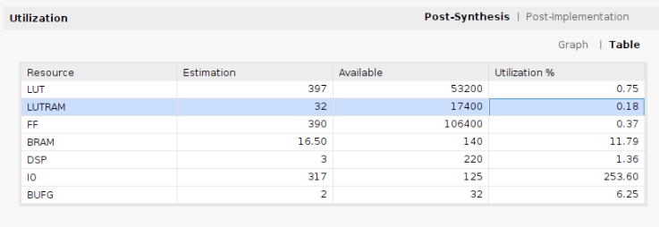
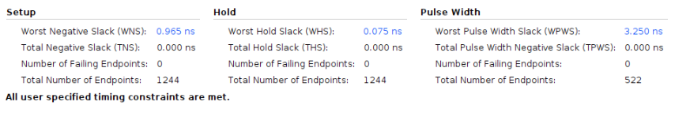
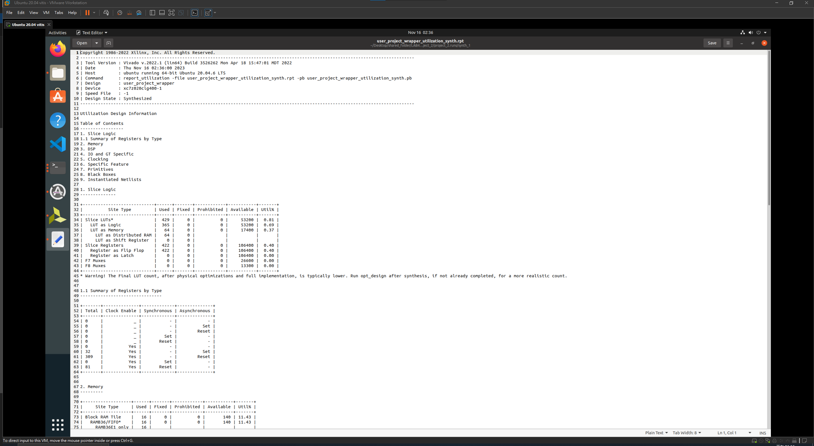

# SOC Design LAB4-2 Group 11

- Introduce the content of the work, and how to replicate the work. (replicate to run simulation)

## Overview

- This project can extend the capability of caravel soc with FIR operation.
- We add two type of FIR operation: software only and hardware accelerator.

## Run code 

1. You need to build caravel soc environment (toolchain) on Linux.

2. Clone the repo and cd to testbench dir.

3. cd to the counter_la_fir.

```
cd ./lab-exmem_fir/testbench/counter_la_fir
```
 

4. Run the following command, and the result would display on the terminal.
```
source run_clean
source run_sim
```


## Results
1. It would run software FIR one times and hardware FIR three times


2. Usage


3. Timing


4. log file


